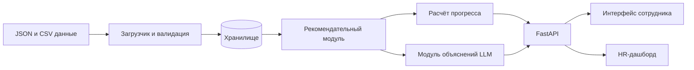

# hack-fe3472cb-aevix
Hackathon team repository for Aevix
# Career Quest

### AI-навигатор развития сотрудника

Проект для кейса **Career Quest** хакатона **HackAlem AI × Halyk Bank**.

> Это стартовая версия README для будущего MVP. Указанные ниже стек, структура проекта и команды запуска — рекомендуемая основа; их нужно синхронизировать с кодом после реализации.

## Идея

Career Quest помогает сотруднику увидеть связь между отдельными HR-активностями и личной карьерной траекторией. Вместо потока разрозненных уведомлений система показывает путь до следующего грейда, рекомендует один–три полезных шага развития и объясняет, почему именно они важны сейчас.

Для HR решение даёт агрегированную картину дефицитов компетенций и вовлечённости в развитие — без публичного сравнения сотрудников друг с другом.

## Проблема

Обучение, менторство, аттестации и внутренние события часто воспринимаются как формальность: сотрудник не понимает, что именно даст ему конкретная активность. В результате обязательные программы проходят в последний момент, добровольные — пропускают, а бюджет на развитие не превращается в заметный рост навыков.

Career Quest отвечает на простой вопрос сотрудника: **«Какой следующий шаг приблизит меня к следующему грейду и почему?»**

## Для кого

- **Сотрудник со стажем 1–5 лет** — видит профиль, дефициты навыков, рекомендации и прогресс.
- **HR-специалист или руководитель** — видит срез по компетенциям, требующим внимания, и может оценить охват программ развития.

## MVP: что должно быть реализовано

- Профиль сотрудника с текущим грейдом, навыками и траекторией до следующего грейда.
- Одна–три персональные рекомендации активностей.
- Объяснение выбора: какой навык развивает активность, насколько он важен для следующего грейда, как повлияла история участия и каким будет ожидаемый прогресс.
- Пересчёт навыков после завершения активности с учётом `gain` и `max_level`.
- HR-экран с агрегированными дефицитами навыков.
- Загрузка дополнительных профилей и истории в формате стартового набора для проверки жюри.
- Разделение прав сотрудника и HR.

Геймификация, внутренняя валюта, награды и мобильная версия не входят в обязательный MVP.

## Как работает рекомендация

Рекомендация не строится по одному минимальному навыку. Сначала система отбирает активности, доступные сотруднику, затем ранжирует их по нескольким факторам:

1. **Карьерный разрыв** — насколько текущий уровень навыка отстаёт от требования следующего грейда.
2. **Влияние активности** — какой прирост даёт событие и может ли он быть применён с учётом `max_level`.
3. **Приоритет навыка** — насколько навык критичен для роли и следующего грейда.
4. **История участия** — завершения, пропуски и отказы по похожим форматам.
5. **Релевантность аудитории** — подходит ли активность роли, грейду и стажу сотрудника.

Для прозрачности можно хранить и показывать стартовую формулу ранжирования:

```text
score = 0.50 × карьерное влияние
      + 0.20 × соответствие профилю
      + 0.15 × история участия
      + 0.10 × новизна
      + 0.05 × доступность
```

Фактическое закрытие дефицита по навыку рассчитывается так:

```text
effective_gain = min(gain, max_level − текущий уровень, карьерный разрыв)
```

LLM используется только для понятного объяснения уже рассчитанных фактов. Числовой расчёт, фильтрация и ранжирование остаются воспроизводимыми и проверяемыми.

**Пример объяснения:**

> System Design — уровень 2 при требуемом уровне 4 для Senior. Предложенная активность может повысить навык на 1 уровень; она приоритетнее Public Speaking, потому что System Design критичен для следующего грейда, а похожие активности сотрудник завершал в срок.

## Пользовательский сценарий

1. HR загружает синтетические данные или жюри добавляет проверочный профиль.
2. Сотрудник открывает свой профиль и видит требования следующего грейда.
3. Система рассчитывает дефициты и показывает одну–три рекомендации с объяснениями.
4. Сотрудник завершает выбранную активность.
5. Система применяет `gain`, не превышая `max_level`, и обновляет прогресс траектории.
6. HR видит, какие навыки чаще всего нуждаются в развитии.

## Данные

Проект рассчитан на стартовый набор синтетических данных из ТЗ:

| Файл | Назначение |
| --- | --- |
| `employees.json` | Около 200 профилей: роль, грейд, стаж и навыки с уровнем от 0 до 5 |
| `events.json` | Около 40 событий, их аудитория, развиваемые навыки, `gain` и `max_level` |
| `activity_history.csv` | 24 месяца участия, включая завершения, пропуски и отказы |
| `skills.json` | Около 60 hard- и soft-skills с требованиями по грейдам |

Данные должны оставаться синтетическими и использоваться только в рамках хакатона. Их нельзя заменять реальными персональными данными.

## Предлагаемый стек

| Слой | Рекомендуемое решение | Зачем |
| --- | --- | --- |
| Frontend | React, TypeScript, Vite | Быстрый интерфейс профиля и HR-дашборда |
| Backend | Python, FastAPI, Pydantic | API, валидация JSON/CSV и документация OpenAPI |
| Аналитика | Pandas | Расчёт дефицитов, работа с историей и агрегатами |
| Хранилище | SQLite для MVP, PostgreSQL для развёртывания | Профили, активности, история и результаты расчётов |
| AI-слой | OpenAI-совместимый API или локальная LLM через Ollama | Генерация объяснения на основе структурированных фактов |
| Контейнеризация | Docker Compose | Запуск одной командой |

> Выбор модели и провайдера следует зафиксировать в `.env.example` и в этом README после реализации. Ключи API не добавляются в репозиторий. Логика ранжирования должна работать и без внешнего LLM-сервиса.

## Целевая архитектура



### Основные компоненты

- **Загрузчик данных** проверяет схему входных JSON/CSV и принимает дополнительные тестовые профили.
- **Рекомендательный модуль** формирует кандидатов, применяет многофакторное ранжирование и возвращает структурированные причины выбора.
- **Модуль прогресса** применяет правила `gain` и `max_level` после завершения активности.
- **LLM-слой** превращает проверяемые причины выбора в короткое человеческое объяснение; он не должен самостоятельно менять расчёт.
- **API и интерфейсы** отдают сотруднику только собственные данные, а HR — только разрешённую агрегированную информацию.

## Предлагаемая структура проекта

```text
career-quest/
├── backend/
│   ├── app/
│   │   ├── api/              # маршруты API
│   │   ├── services/         # рекомендации, прогресс, объяснения
│   │   ├── models/           # схемы данных
│   │   └── repositories/     # доступ к хранилищу
│   ├── tests/
│   └── requirements.txt
├── frontend/
│   ├── src/
│   └── package.json
├── data/                     # синтетический стартовый набор, не коммитить при запрете ТЗ
├── docker-compose.yml
├── .env.example
└── README.md
```

## Установка и запуск

После создания MVP можно использовать следующий сценарий. До появления указанных файлов эти команды являются шаблоном.

```bash
git clone <URL_РЕПОЗИТОРИЯ>
cd career-quest

cp .env.example .env
docker compose up --build
```

Ожидаемые адреса локального запуска:

- интерфейс: `http://localhost:5173`;
- API: `http://localhost:8000`;
- документация API: `http://localhost:8000/docs`.

Пример необходимых переменных окружения:

```dotenv
LLM_PROVIDER=ollama
LLM_MODEL=<ИМЯ_МОДЕЛИ>
LLM_BASE_URL=http://localhost:11434
DATABASE_URL=sqlite:///./career_quest.db
```

## Как проверить MVP

1. Загрузите набор `employees.json`, `events.json`, `activity_history.csv` и `skills.json`.
2. Откройте профиль сотрудника, у которого `Public Speaking` ниже других навыков, но он несколько раз пропускал похожие активности, а `System Design` критичен для следующего грейда.
3. Проверьте, что рекомендация приоритизирует не просто минимальный навык, а значимый для карьерного перехода шаг с учётом истории.
4. Убедитесь, что показаны одна–три рекомендации и причины выбора.
5. Сверьте указанный прирост с формулой `min(gain, max_level − текущий уровень, карьерный разрыв)`.
6. Отметьте активность как выполненную и проверьте изменение навыка в пределах `max_level`.
7. Войдите в роль HR и проверьте агрегированный срез дефицитов без публичного рейтинга сотрудников.

## Нефункциональные требования

- Отклик интерфейса — до 2 секунд.
- Формирование AI-рекомендации — до 10 секунд.
- Рекомендации должны быть объяснимыми и воспроизводимыми.
- Данные вовлечённости сотрудника не показываются другим сотрудникам без согласия.
- Решение должно запускаться одной командой.

## Ограничения MVP

- Используются только синтетические данные из стартового набора.
- Рекомендация поддерживает решение сотрудника, но не принимает кадровые решения автоматически.
- Нельзя использовать публичные рейтинги результативности и начислять очки за обязательные процессы.
- Геймификация — опциональное расширение, а не обязательная часть проекта.
- Deployed-версия пока не указана. После публикации добавьте ссылку: `https://<URL_ПРИЛОЖЕНИЯ>`.

## Команда

